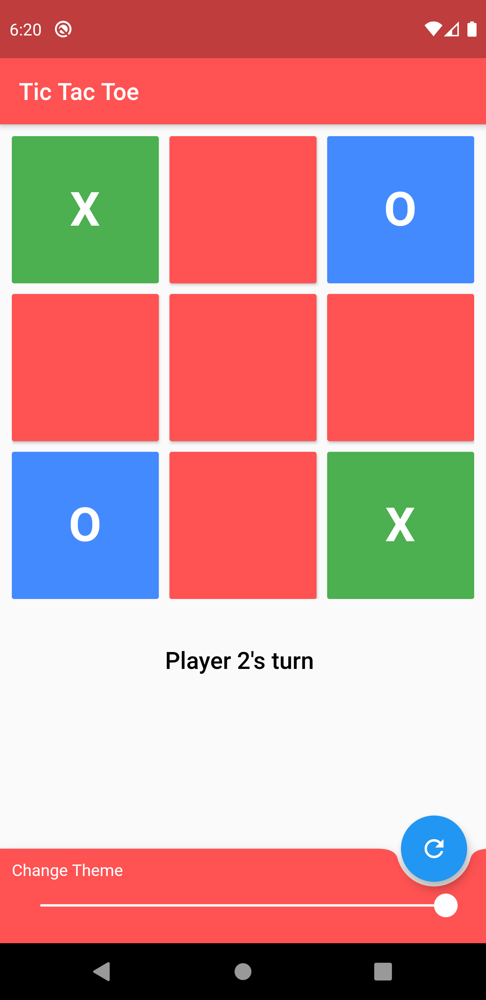
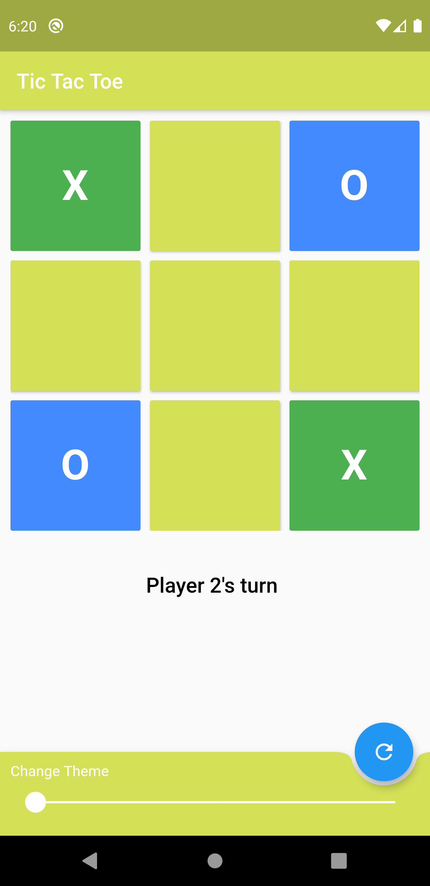

# Tic-Tac-Toe

A tic-toa-toe game created using Flutter.

## Build With
* [Flutter](https://pub.dev/packages/backdrop) -  Flutter is Google’s UI toolkit for building beautiful, natively compiled applications for mobile, web, and desktop from a single codebase.

  

## Visuals

<table>
  <tr>
    <td> Screen 1 </td>
     <td>Screen 2 </td>
     <td>Screen 3 </td>
  </tr>
  <tr>
    <td></td>
    <td></td>
    <td></td>
  </tr>
 </table>
 

## Contributing

Pull requests are welcome.
